# 项目提交说明
## 用户管理
-任务类型：原型设计
-原型图：
https://haochiyu526.github.io/re01-one/

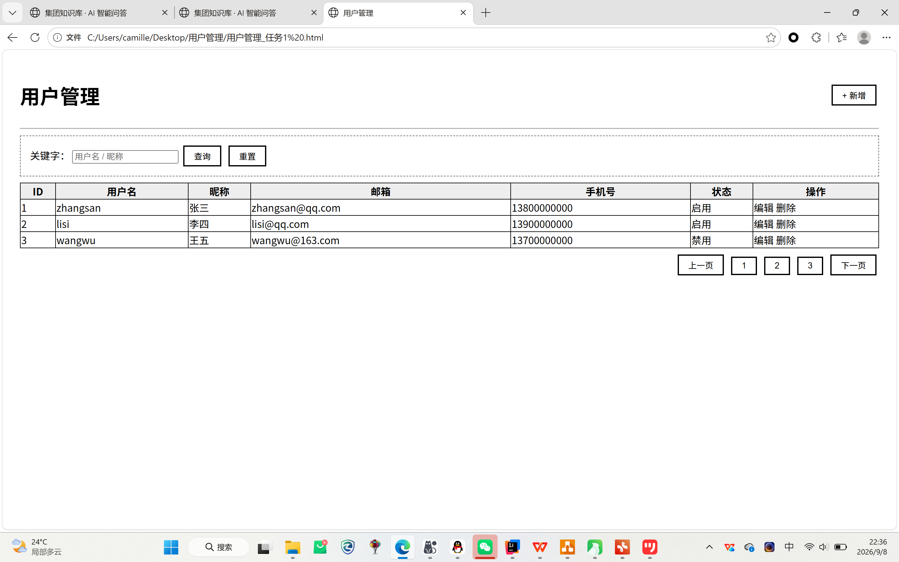

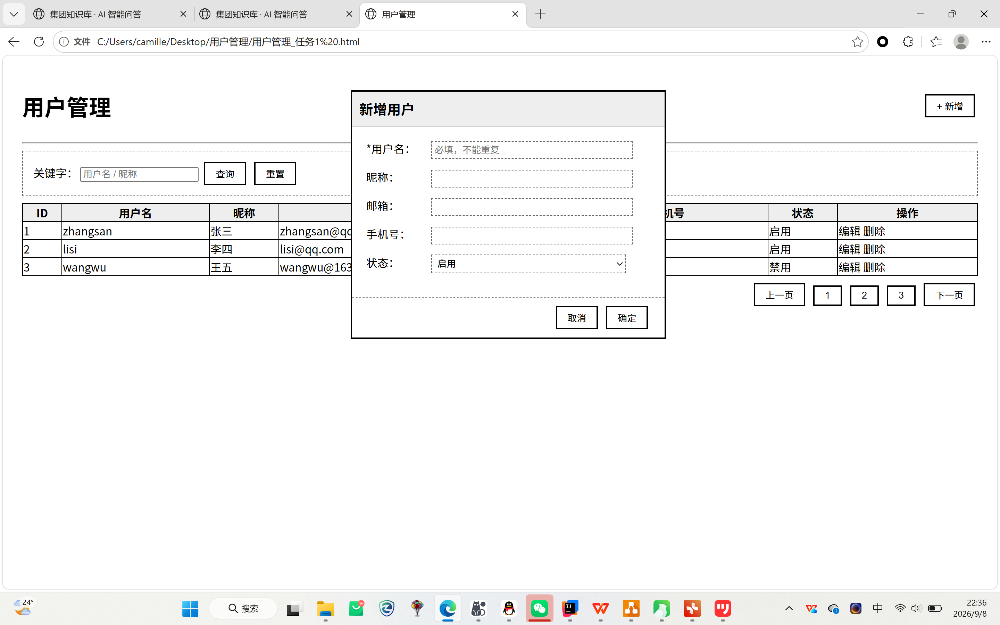

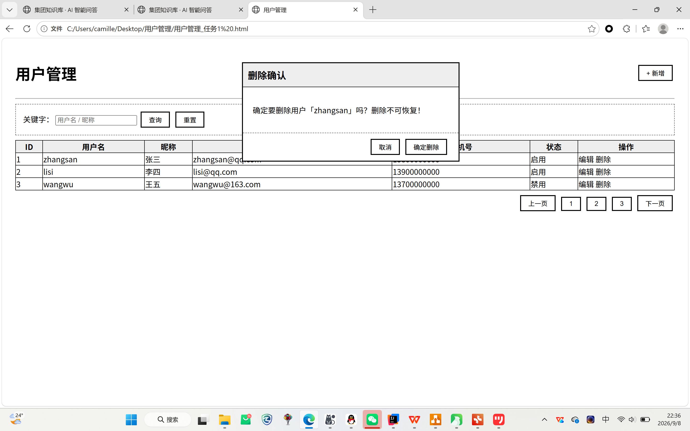

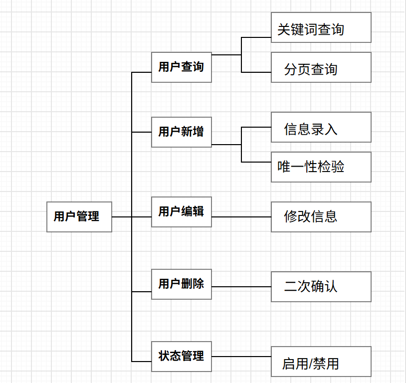

-说明文字：
1.列表页：查询条件区（关键字搜索）、数据表格（ID/用户名/昵称/邮箱/手机号/状态/操作）、分页
2.新增/编辑弹窗：表单字段（用户名/昵称/邮箱/手机号/状态），必填项标*
3.删除确认：二次确认弹窗

## 角色管理
- 任务类型：架构设计
- 架构图：

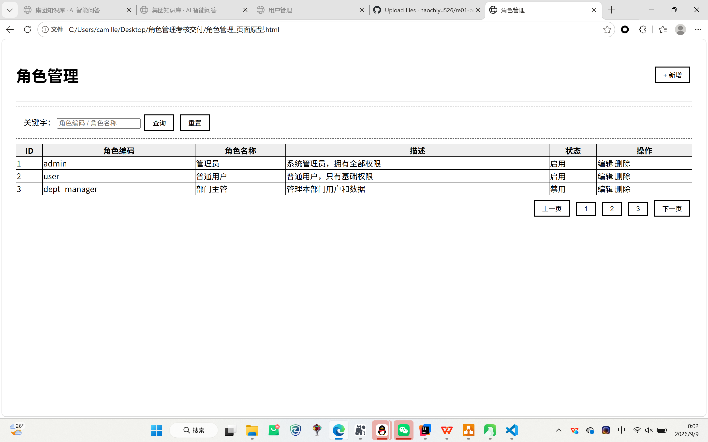

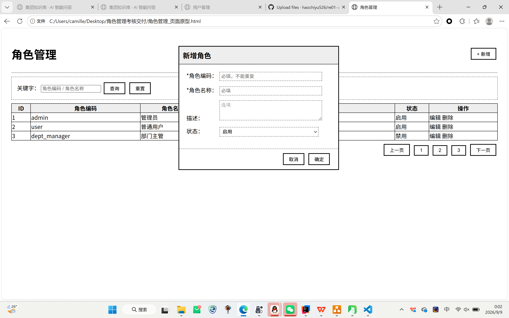

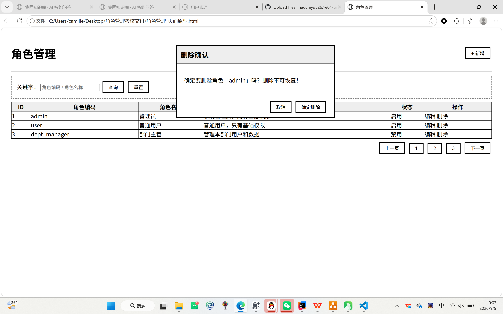

-说明文字：
1.列表页：查询条件区（关键字搜索）、数据表格（ID/角色编码/角色名称/角色描述/状态/操作）、分页
2.新增/编辑弹窗：表单字段（角色编码/角色名称/角色描述/状态），必填项标*
3.删除确认：二次确认弹窗，已绑定用户的角色禁止删除

## 部门管理
-任务类型：原型设计
- 原型图：
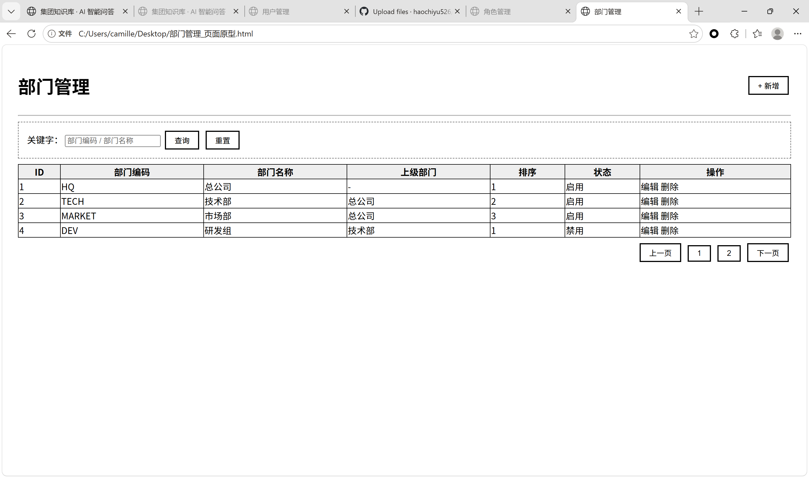

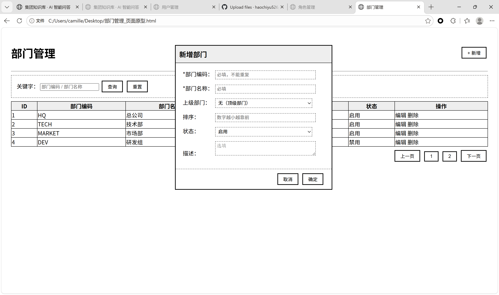

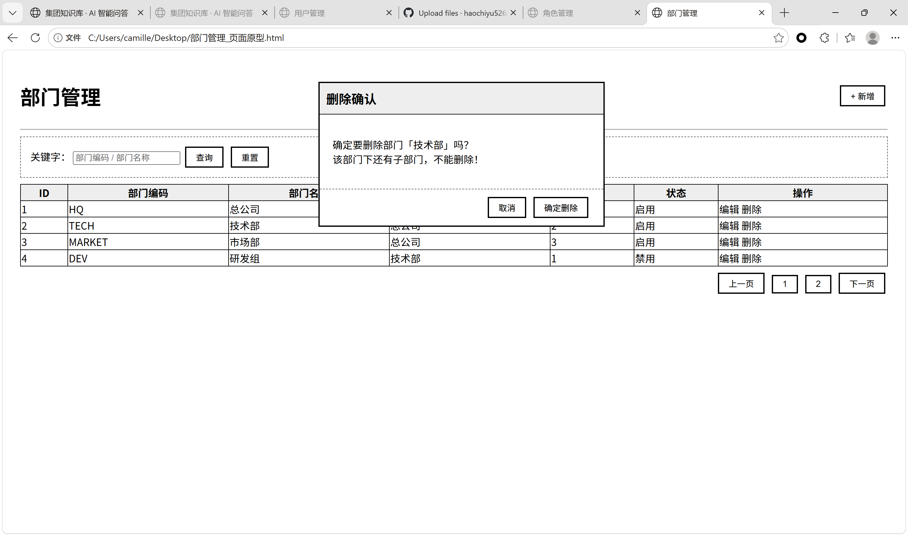
- 说明文字：
1.列表页：查询条件区（关键字搜索）、数据表格（ID/部门编码/部门名称/上级部门/排序/状态/操作）、分页
2.新增/编辑弹窗：表单字段（部门编码/部门名称/上级部门/排序/状态/描述），必填项标*
3.删除确认：二次确认弹窗，存在子部门时禁止删除

## 岗位管理
-任务类型：思维导图
-思维导图：
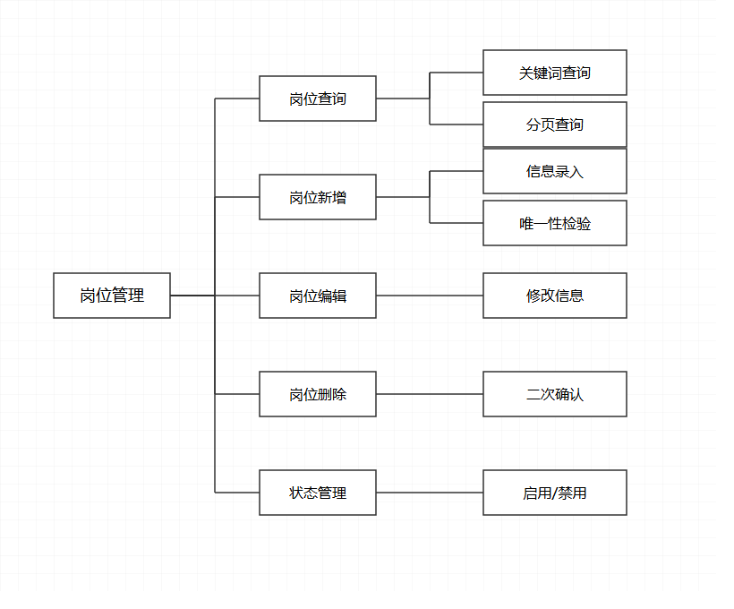
-说明文字：
1.岗位查询：支持关键字检索、分页查询岗位列表
2.岗位新增：录入岗位信息，校验岗位编码唯一性
3.岗位编辑：修改岗位基础信息
4.岗位删除：删除操作增加二次确认
5.状态管理：对岗位执行启用/禁用操作

## 权限管理
-任务类型：架构设计 / 思维导图
- 架构图/思维导图：
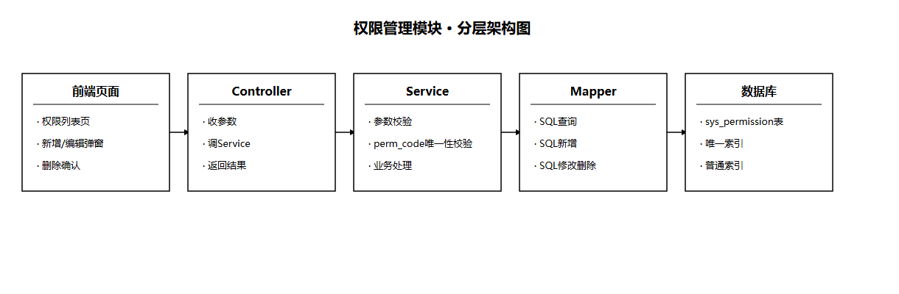

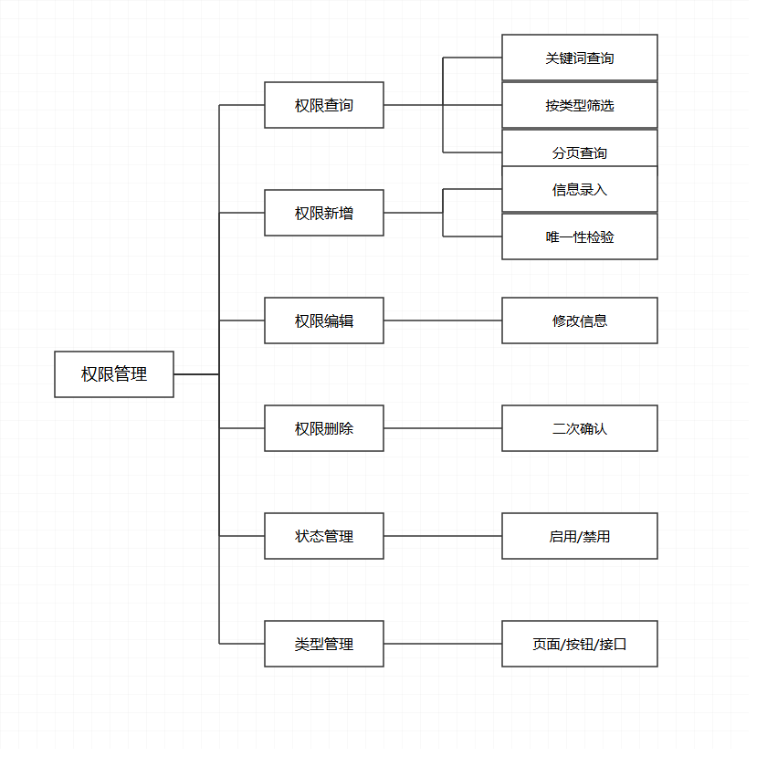
-说明文字：
1.列表页：查询条件区（关键字搜索）、数据表格（ID/权限编码/权限名称/权限类型/父级权限/状态/操作）、分页
2.新增/编辑弹窗：表单字段（权限编码/权限名称/权限类型/父级权限/排序/状态），必填项标*
3.删除确认：二次确认弹窗，存在子权限时禁止删除
